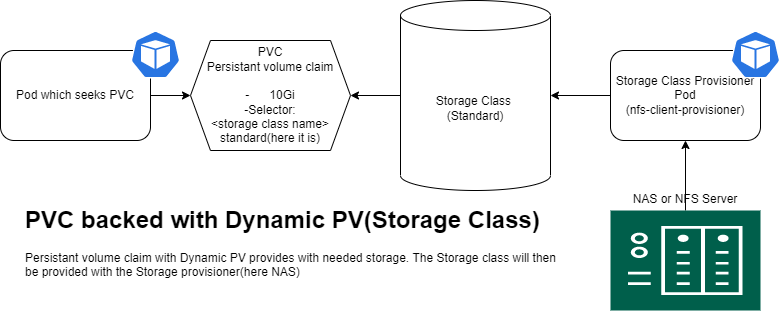

# onprem_kubernetes_nfs_storage-class
## Overview

## Storage Class
A StorageClass is a Kubernetes resource that enables dynamic storage provisioning. 
The administrator configures the StorageClass, which can then no longer be modified. First the StorageClass is created, then the PersistentVolumeClaim and finally the Pod. When a PVC is created, Kubernetes creates a PersistentVolume and binds it to the PVC automatically, depending on the VolumeBindingMode used in the StorageClass configuration. These three Kubernetes objects are required to check the test case of a StorageClass.

## Pre-Requesites.
A Fully equipped kubernetes system with access to NFS Server
NFS Server with client(Packages) been installed in all machines of kubernetes(all nodes & Master)


## RBAC - Role Based Access Control script for NFS storage has to be implemented
by applying the rbac.yaml file, the access to the NFS storage been ready, 
You can change your namespace as per your requirements,
```
kubectl apply -f rbac.yaml
```
### deployment.yaml - to deploy the provisioner pod for the NFS access, 
here you can replace the IPs with your Hostname/IP for you high iops ssd NFS driver.
You can change your namespace as per your requirements,
```
kubectl apply -f deployment.yaml
apiVersion: apps/v1
kind: Deployment
metadata:
  name: nfs-client-provisioner
  labels:
    app: nfs-client-provisioner
  # replace with namespace where provisioner is deployed
  namespace: default
spec:
  replicas: 1
  strategy:
    type: Recreate
    
 
  selector:
    matchLabels:
      app: nfs-client-provisioner
  template:
    metadata:
      labels:
        app: nfs-client-provisioner
    spec:
      serviceAccountName: nfs-client-provisioner
      containers:
        - name: nfs-client-provisioner                                          #A name which you want to use in the storage class.
          image: k8s.gcr.io/sig-storage/nfs-subdir-external-provisioner:v4.0.2
          volumeMounts:
            - name: nfs-client-root
              mountPath: /persistentvolumes
          env:
            - name: PROVISIONER_NAME
              value: nfs-client-provisioner
            - name: NFS_SERVER
              value: 172.30.17.50                                               #NFS Server IP/hostname
            - name: NFS_PATH                                                    #NFS share name as mentioned in the NFS deployment.
              value: /store
      volumes:
        - name: nfs-client-root
          nfs:
            server: 172.30.17.50                                                 #NFS Server IP/hostname
            path: /store                                                         #NFS share name as mentioned in the NFS deployment.

```

### class.yaml - to create the storage class to provision the PVCs.
you can give the provisioner name, as you wish here, which should be match with the deployment.yaml.
here it is "nfs-client-provisioner"
```
kubectl apply -f class.yaml
```
yaml at a glance, 
```
apiVersion: storage.k8s.io/v1
kind: StorageClass
metadata:
  name: standard                      #You can change it to the one name which you would like.
provisioner: nfs-client-provisioner   #Here you can give the provisioner name
parameters:
  archiveOnDelete: "false"
```

## Test your PVC with sample one.
```
kubectl apply -f pvc.yaml
```
Yaml contents
```
apiVersion: v1
kind: PersistentVolumeClaim
metadata:
  name: pvc-nfs-kubedata-nginx-1
  annotations:
   volume.beta.kubernetes.io/storage-class: standard  # <  the dynamic nfs storage call we have created earlier
spec:
  accessModes:
    - ReadWriteMany
  resources:
    requests:
      storage: 5Gi
```
## Observations
### In the cluster control plane.
```
$kubectl get sc        #Storage class
NAME       PROVISIONER              RECLAIMPOLICY   VOLUMEBINDINGMODE   ALLOWVOLUMEEXPANSION   AGE
standard   nfs-client-provisioner   Delete          Immediate           false                  135m

$kubectl get pvc       #Persistance volume claim
NAME                       STATUS   VOLUME                                     CAPACITY   ACCESS MODES   STORAGECLASS   AGE
pvc-nfs-kubedata-nginx-1   Bound    pvc-64fd69e8-c7a1-4861-a4a8-bcdc1fd687cd   1Mi        RWX            standard       132m

```
### In NFS share server/NAS
if you can check the shared storage, we can see things as shown below.
```
$cd /store/
$ls
default-pvc-nfs-kubedata-nginx-1-pvc-64fd69e8-c7a1-4861-a4a8-bcdc1fd687cd    #You can see a share which looks like this.
```

## Result.
Now there is a storage class which is named as "standard" is ready to provide provisions. There is no need of worrying about the PV creation each time you need.
